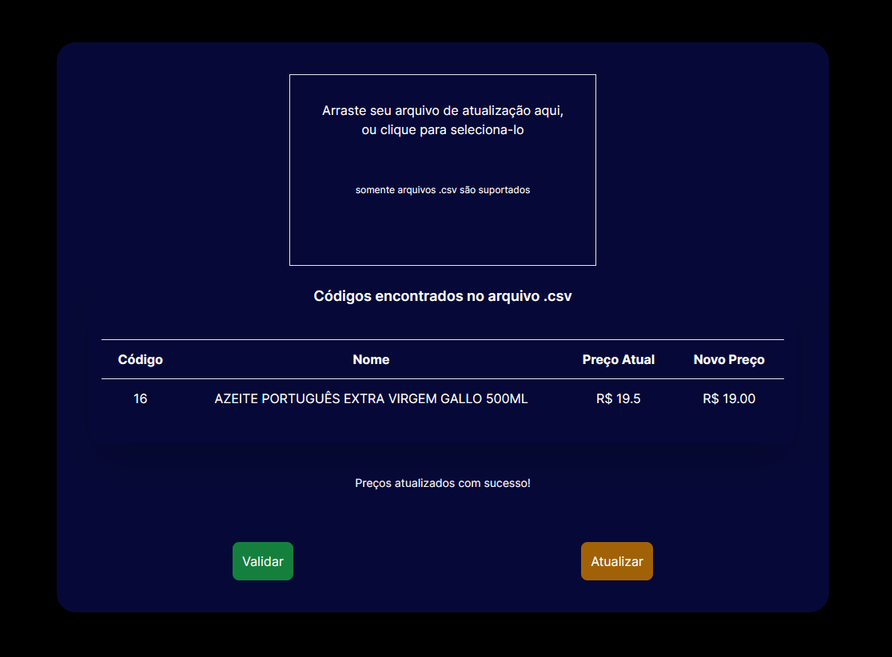

# PricerUpdater

## Desafio Shopper

O PricerUpdater é uma aplicação web que permite atualizar em lote os produtos a partir de um arquivo .csv. No entanto, é importante observar algumas regras para garantir que o processo seja bem-sucedido:

- **Todos os campos necessários existem?** Certifique-se de que o arquivo .csv contenha todos os campos obrigatórios.

- **Os códigos de produtos informados existem?** Verifique se os códigos dos produtos mencionados no arquivo .csv estão corretos e existem no banco de dados.

- **Os preços estão preenchidos e são valores numéricos válidos?** Garanta que os preços listados no arquivo .csv sejam numéricos e preenchidos corretamente.

- **Os preços de atualização dos produtos ficarão abaixo do custo deles?** Evite definir preços de atualização que sejam menores do que o custo dos produtos.

- **O valor de reajuste, para mais ou para menos, ultrapassa 10% do preço atual do produto?** Certifique-se de que os ajustes de preço não excedam 10% do valor atual do produto.

## Tutorial

### Passos para Executar o Projeto:

1. **Clone o Repositório da API:**

   Acesse o repositório da API em [raonicerqueira/desafio-shopper-server](https://github.com/raonicerqueira/desafio-shopper-server) e clone o projeto para o seu desktop.

2. **Abra o Projeto no VSCode:**

   Utilize o Visual Studio Code (VSCode) para abrir o projeto. Caso não tenha o VSCode instalado, você pode baixá-lo [aqui](https://code.visualstudio.com/).

3. **Inicialize a API:**

   Abra um terminal na pasta do projeto e execute o comando `npm run dev`. Se tudo estiver configurado corretamente, você verá a mensagem "Server is running...".

4. **Clone o Projeto PricerUpdater:**

   Acesse o repositório do PricerUpdater em [raonicerqueira/desafio-shopper](https://github.com/raonicerqueira/desafio-shopper) e clone o projeto para o seu desktop.

5. **Inicialize a Aplicação Web:**

   Abra um terminal na pasta do projeto PricerUpdater e execute os comandos `npm install` seguido por `npm run dev`. A aplicação web deverá iniciar, e o endereço local será exibido na porta 3000.

6. **Banco de Dados MySQL:**

   É necessário configurar um banco de dados MySQL chamado "estoque" com o usuário e senha "root". Na pasta "assets," você encontrará um arquivo chamado "database.sql" que pode ser utilizado para criar o banco de dados.

7. **Utilize o Arquivo .csv:**

   Agora você está pronto para usar um arquivo .csv para atualizar os preços dos produtos armazenados no banco de dados. Certifique-se de que o arquivo .csv siga o mesmo modelo do arquivo na pasta "assets" do projeto.

Dessa forma, você poderá aproveitar o PricerUpdater para atualizar seus produtos de forma eficiente e controlada. Se tiver alguma dúvida ou precisar de assistência, não hesite em entrar em contato.

**Divirta-se atualizando seus preços!**
